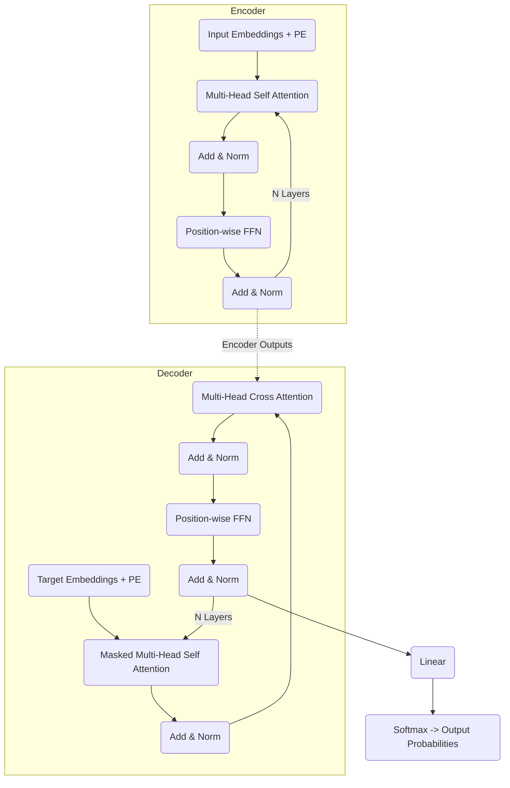

# Attention Is All You Need — SDE Level Implementation


from-scratch PyTorch implementation of the seminal paper *"Attention Is All You Need"* (Vaswani et al., 2017).

Unlike typical Jupyter Notebook implementations, this project is designed with best practices:
- **Modular Design:** Segregated modules for configuration, data, architecture, training, and evaluation.
- **Type Safety:** Uses `dataclasses` for configurations and standard Python typing.
- **Robust Training:** Includes custom Learning Rate Scheduling (Warmup + Decay), mixed precision (`torch.cuda.amp`), and gradient accumulation.
- **Checkpointing:** Resilient to disconnects (e.g., Google Colab limits) with automatic resume logic.
- **Hardware Agnostic:** Automatically dynamically scales to run on NVIDIA CUDA, Apple Silicon MPS, or generic CPUs.

## 🏗️ Architecture Overview

The core architecture follows the encoder-decoder paradigm utilizing self-attention mechanisms without Recurrent or Convolutional Networks.



### Technical Highlights
- **Scaled Dot-Product Attention:** Applies a scaling factor of `1/√d_k` to prevent vanishing gradients within the Softmax function.
- **Post-LayerNorm:** In strict adherence to the original 2017 paper, Layer Normalization occurs *after* the residual addition (`x + Sublayer(x)`).
- **Label Smoothing:** A custom Label Smoothing Loss module implementing KL-Divergence based smoothing (`ε=0.1`).
- **Warmup Optimizer:** The Custom `NoamOpt` scheduler increases LR linearly for the first `warmup_steps` (4000), then decreases proportionally to the inverse square root of the step number.

---

## 🚀 Running on Google Colab

This repository is optimized for execution on Google Colab (Free Tier / T4 GPUs). 
To run it on Colab, open a new Notebook and run the following cells:

### 1. Clone the Repository & Install Dependencies
```python
!git clone https://github.com/Paramveersingh-S/attention-is-all-we-need-imp.git
%cd attention-is-all-we-need-imp
!pip install -q torch torchvision torchaudio
!pip install -q datasets tokenizers sacrebleu matplotlib seaborn
```

### 2. Overfit Sanity Check (Recommended)
Before running a long training sequence, verify the logic works flawlessly on a single batch:
```bash
!python main.py --mode overfit
```
*You should see the loss plummet near zero within 200 steps.*

### 3. Full Training (Resilient)
```bash
!python main.py --mode train
```
*Note: Colab may disconnect you after 90 minutes of inactivity. Don't worry! `main.py` saves checkpoints dynamically. Re-running the cell above will automatically load the last checkpoint and resume.*

### 4. Evaluation and Attention Heatmaps
```bash
!python main.py --mode eval
```
*This calculates the BLEU score using `sacrebleu`, translates a sample sentence, and generates an attention heatmap (`attention_heatmap.png`) showing internal head mechanics.*

---

## 📁 Repository Structure

- `config.py` - Typed configuration system managing Hyperparameters.
- `data.py` - Tokenizer training (BPE via HF) and PyTorch Dataset/DataLoader dynamic batching.
- `model.py` - Complete Transformer Architecture from scratch (MHA, FFN, Positional Encoding).
- `train.py` - Core training engine (AMP, Optimizer, Scheduler, KL Loss, Checkpointing).
- `evaluate.py` - BLEU evaluations, Autoregressive greedy generation, Heatmap visualization.
- `main.py` - CLI entry point binding the infrastructure together.
